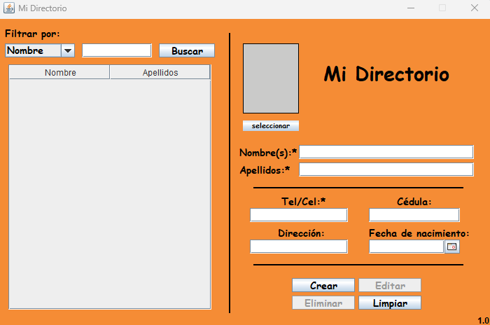
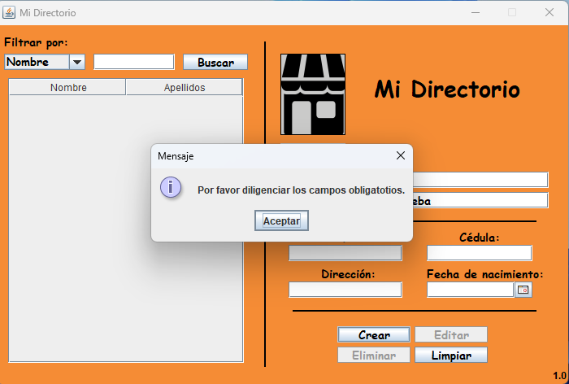
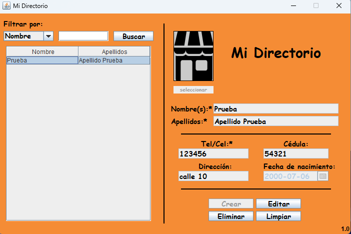

# Mi_Directorio
Esta es una aplicación de escritorio que cumple la función de directorio personal, está realizada en Java 8 y utiliza
una base de datos MySQL.

Video de exposición: https://www.youtube.com/watch?v=eu2eRHMCSgQ

Para utilizar la solución tenga en cuenta los siguientes apartados:

<ul>
    <li>Utilizar Java SE 8.</li>
    <li>En el repositorio encontrará un archivo llamado “midirectorio.sql”, este archivo es la base de datos MySQL, por
        lo tanto deberá importarla en su motor de base de datos MySQL.</li>
    <li>El archivo “Conexión.java” ubicado en src/modelo/Conexión.java contiene las variables “usuario” y “contraseña”,
        adecue el valor de estas variables de acuerdo con la configuración de su base de datos MySQL.</li>
    <li>La aplicación de construcción utilizada es Apache Ant, por ende, debe importar de manera manual las siguientes
        bibliotecas, las cuales se encuentran incluidas en este repositorio:</li>
    <ul>
        <li>Conector de MySQL: “mysql-connector-java-5.1.46-bin.jar”</li>
        <li>Calendario: “jcalendar-1.4.jar”</li>
    </ul>
</ul>

<h2>Capturas de pantalla:</h2>

